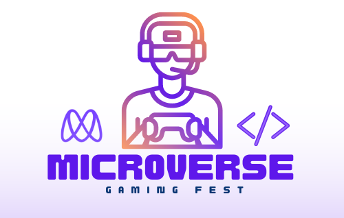

  
   
  <h2><b>First Capstone - Microverse Gaming Fest</b></h2>

<!-- TABLE OF CONTENTS -->

# 📗 Table of Contents

- [📖 About the Project](#about-project)
  - [🛠 Built With](#built-with)
    - [Tech Stack](#tech-stack)
    - [Key Features](#key-features)
  - [🚀 Live Demo](#live-demo)
- [💻 Getting Started](#getting-started)
  - [Setup](#setup)
  - [Prerequisites](#prerequisites)
  - [Install](#install)
  - [Usage](#usage)
  - [Run tests](#run-tests)
  - [Deployment](#triangular_flag_on_post-deployment)
- [👥 Authors](#authors)
- [🔭 Future Features](#future-features)
- [🤝 Contributing](#contributing)
- [⭐️ Show your support](#support)
- [🙏 Acknowledgements](#acknowledgements)
- [❓ FAQ](#faq)
- [📝 License](#license)

<!-- PROJECT DESCRIPTION -->

# 📖 [First_Capstone-Microverse_Gaming_Fest] 

**[First Capstone - Microverse Gaming Fest is my first responsive web page built in my Microverse journey. It is a gaming festival announcement page in where you can find all the details for that event.]** 

## 🛠 Built With 

### Tech Stack 

> Relevant tech stack of the project.

  
Programming Tools

  <ul>
    <li>HTML</li>
    <li>CSS</li>
    <li>Javascript</li>
  </ul>

  
Dev Tools

  <ul>
    <li>Git</li>
    <li>GitHub</li>
  </ul>

Text Editor

  <ul>
    <li>VS Code</li>
  </ul>

  

<!-- Features -->

### Key Features 

> Key features of the application.

- **[First_Capstone_Project]**
- **[Complete_Responsive_Website]**

(<a href="#readme-top">back to top</a>)

<!-- LIVE DEMO -->

## 🚀 Live Demo 

> Live Demo of "First Capstone" project using Github Pages.

- Web Project: [Microverse Gaming Fest Website](https://juandiegoguerra.github.io/Capstone_Project-GamingFest_Page/)

(<a href="#readme-top">back to top</a>)

<!-- GETTING STARTED -->

## 💻 Getting Started 

> How to make use of the project.

To get a local copy up and running, follow these steps.

### Prerequisites

In order to run this project you need:

Git,
Github web or Github desktop,
VS Code and
Node.js (to use npm commands)
  "not sure how to use npm? Read" <a href="https://docs.npmjs.com/downloading-and-installing-node-js-and-npm" rel="nofollow">this</a>.

### Setup

Clone this repository to your desired folder:

- 1️⃣ Open Git Bash.
- 2️⃣ Change the current working directory to the location where you want the cloned directory.
- 3️⃣ Type: `git clone https://github.com/JuanDiegoGuerra/Capstone_Project-GamingFest_Page.git`
- 4️⃣ Press Enter to create your local clone.

### Install

Install this project with:

NOTE: If you are running on Windows, you need to initialize npm to create package.json file.
<pre class="notranslate"><code>npm init -y
</code></pre>

<li> "Webhint " 
  <code>npm install --save-dev hint@7.x
</code>
</li>

<li> "Stylelint " 
  <code>npm install --save-dev stylelint@13.x stylelint-scss@3.x stylelint-config-standard@21.x stylelint-csstree-validator@1.x
</code>
</li>

<li> "Yarn " 
  <code>yarn install --audit
</code>
</li>

### Usage

To run the project, execute the following command:

<li> "Run this code and then fix the validation errors (if needed).
<pre class="notranslate"><code>npx hint .
</code></pre>
</li>

Run <code>npx stylelint "**/*.{css,scss}"</code> on the root of your directory of your project.
Fix linter errors

### Run tests

No test needed for this project.

### Deployment

You can deploy this project using: 

VS Code and Google Chrome.

(<a href="#readme-top">back to top</a>)

<!-- AUTHORS -->

## 👥 Authors 

👤 **Juan Diego Guerra**

- GitHub: [@JuanDiegoGuerra](https://github.com/JuanDiegoGuerra)

(<a href="#readme-top">back to top</a>)

<!-- FUTURE FEATURES -->

## 🔭 Future Features 

> Features that will be added to the project.

- [ 1 ] **[Better_transitions]**
- [ 2 ] **[Better_javascript_actions]**
- [ 3 ] **[More_content_in_general]**

(<a href="#readme-top">back to top</a>)

<!-- CONTRIBUTING -->

## 🤝 Contributing 
> Designer's Attribution 👨🏽‍🚀🎨

- Original design idea: [Cindy Shin Attribution](https://creativecommons.org/licenses/by-nc/4.0/)

-> Feel free to check the [issues page](../../issues/).

(<a href="#readme-top">back to top</a>)

<!-- SUPPORT -->

## ⭐️ Show your support 

> You can support following me.

 - If you like this project you can follow me 🤩! I will be adding more useful material 😁.

(<a href="#readme-top">back to top</a>)

<!-- ACKNOWLEDGEMENTS -->

## 🙏 Acknowledgments 

> Credits to: 

 - Big thanks to the designer of the template, CINDY SHIN. You can check the attributtion of her design in the contributing section.

 - I would like to thank my gf 😳 because she fed me when I was starving after coding for a lot of hours 🤭.

 - I would like to thank Microverse too because it inspired me finish this challenge as it has to be 💪🏼.

(<a href="#readme-top">back to top</a>)

<!-- FAQ (optional) -->

## ❓ FAQ (Frequently Asked Questions) 

> You could face some problems when doing this project for the first time, so please check this FAQ.

- **[Why_is_my_Lighthouse_linter_not_working_?]**

  - [If you have this specific problem, go to your ".yml" file and check the node-version of the specific linter. Best version for this project is "14" (in my case it was "18x" and I changed it)]

- **[Wich_files_should_I_add_in_my_gitignore_?]**

  - [Feel free to add any file you think is not necessary to be on your repo, but be careful when you add or create new files that might not be necessary in your repo but aren't written in your gitignore.]

(<a href="#readme-top">back to top</a>)

## 📝 License 

This project is [MIT](./LICENSE) licensed.

(<a href="#readme-top">back to top</a>)
